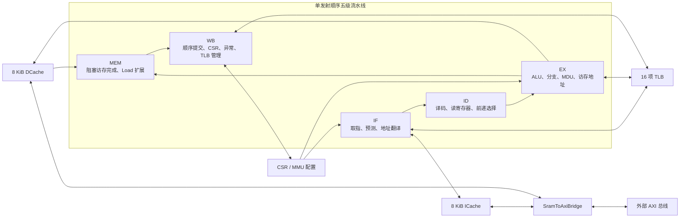

# CPU 总体设计说明

本文档总结当前版本 CPU 的总体结构、流水线控制、分支预测、存储系统、地址翻译以及异常处理机制。代码采用 Scala/Chisel 编写，生成 SystemVerilog 后接入龙芯杯提供的 Vivado 工程。

## 1. 设计概览

当前 CPU 是面向 LoongArch 32 位指令子集的单发射、顺序执行、顺序提交处理器，采用五级流水线：

```text
IF → ID → EX → MEM → WB
```

主要配置如下：

| 项目 | 当前实现 |
| --- | --- |
| 流水线 | 单发射、顺序五级流水线 |
| 数据宽度 | 32 位 |
| 启动地址 | `0x1c000000` |
| 通用寄存器堆 | 32×32 位，2 读 1 写，`r0` 恒为 0 |
| 分支预测 | 32 项直接映射 BTB，每项一个 2 位饱和计数器 |
| TLB | 16 项全相联，双组合查询端口，支持 4 KiB/2 MiB 页 |
| ICache | 8 KiB，2 路组相联，16 B Cache line |
| DCache | 8 KiB，2 路组相联，16 B Cache line，写回、写分配 |
| 外部总线 | 32 位 AXI 主接口，经 I/D Cache 共用转接桥接出 |
| 数据访存 | 阻塞模式，一次最多维护一条数据访存指令 |
| 乘法 | 流水化 32×32 位乘法器 |
| 除法 | Vivado Divider Generator IP，单请求在途 |
| 中断 | 8 位硬件中断输入，并支持软件中断和定时器中断状态 |

当前比赛环境功能测试已经全部通过。现有 Implementation 结果约为 57.1 MHz，WNS 约为 0.78 ns；频率数据会随 Vivado 版本、器件、约束和实现策略变化。

## 2. 顶层结构



五个流水级之间使用单项 `Decoupled` ready/valid 通道连接。每一级最多保存一条有效指令，后级反压会逐级冻结前级，因此除法、Cache miss、非缓存访问和总线等待都能沿同一套握手机制阻塞流水线。

顶层同时提供比赛要求的写回调试接口，包括写回 PC、寄存器写使能、写回寄存器号和写回数据。

## 3. 五级流水线

### 3.1 IF：取指级

IF 级负责：

- 保存下一条取指 PC，并从 `0x1c000000` 启动。
- 查询分支预测器，选择顺序地址 `PC + 4` 或预测目标地址。
- 根据 `CRMD`、`DMW0/1` 和 TLB 完成指令地址翻译。
- 根据 MAT 属性判断是否执行非缓存取指。
- 检查取指地址对齐、TLB 重填、取指页无效和页特权等级异常。
- 通过类 SRAM 请求接口访问 ICache。

前端最多保存一个未返回的取指请求，但旧响应能够在同一拍被 ID 接收时，请求槽也会在该拍释放，从而允许下一地址与 ICache 进行背靠背握手。若 ID 发生反压，IF 内部的一项缓冲会保存已经返回的指令。

流水线冲刷发生时，IF 会跳转到控制器给出的目标 PC；对于冲刷前已经发出但尚未返回的请求，使用丢弃标志吞掉迟到响应，避免旧指令进入新的控制流。

### 3.2 ID：译码级

ID 级完成预译码、完整译码、双口寄存器读取、立即数生成、数据相关判断以及源操作数前递选择。

当前实现将前递选择提前到 ID→EX 流水寄存器之前完成，优先级为：

```text
EX 结果 → MEM 结果 → 寄存器堆读数
```

WB 在同一拍写回并被 ID 读取时，由寄存器堆内部的 write-first 旁路直接返回写回数据。这样进入 EX 的操作数已经稳定，不需要再由 MEM/WB 的目的寄存器号驱动 EX 内部的实时前递多路器。

以下结果在相应阶段尚未产生，不能直接前递，因此 ID 会暂停相关指令：

- 位于 EX 或 MEM 的 load 结果；
- 位于 EX 或 MEM 的 CSR 读取结果；
- 与尚未完成 CSR 操作相关的 TLB 管理指令。

### 3.3 EX：执行级

EX 级负责：

- 完成整数加减、比较、逻辑和移位运算；
- 计算并校验分支实际方向与目标地址；
- 执行乘除法，并在多周期运算期间阻塞流水线；
- 生成 load、store 和 CACOP 的有效虚拟地址；
- 通过 TLB 端口 1 完成数据地址翻译；
- 检查访存对齐及 MMU 相关异常；
- 生成字节、半字和字写掩码与写数据；
- 向 DCache 或 CACOP 对应的 Cache 发出请求。

访存地址使用独立加法器：

```text
mem_va = src1 + imm
```

TLB 查询、对齐检查、Cache 地址和访存异常判断直接使用 `mem_va`，不再经过通用 ALU 的多路结果选择。这一结构用于缩短原先从前递网络经过 ALU、TLB 和 MMU 再到 Cache/MEM 寄存器的公共长路径。

每条访存指令只允许发生一次 `addr_ok` 握手。若 EX 因后级反压暂留，`mem_req_sent` 会抑制重复请求；指令离开 EX 或发生 flush 后，该状态才会清除。

### 3.4 MEM：访存完成级

普通 ALU 指令可以直接通过 MEM。load、store 和 CACOP 会在本级等待 Cache 返回 `data_ok`，因此数据访存对整条流水线是阻塞式的。

load 数据在 MEM 中按照地址低位选择，并执行以下扩展：

- `ld.b`、`ld.h`：符号扩展；
- `ld.bu`、`ld.hu`：零扩展；
- `ld.w`：直接返回 32 位数据。

若流水线冲刷时仍有访存响应在途，MEM 会记录丢弃状态并吞掉迟到的 `data_ok`，防止它被后续新指令错误接收。

### 3.5 WB：写回级

WB 是体系结构状态的顺序提交点，负责：

- 写回通用寄存器堆；
- 读写 CSR；
- 提交 `TLBWR`、`TLBFILL` 和 `TLBRD`；
- 接收外部硬件中断并处理定时器中断；
- 提交异常和 `ERTN`；
- 在 MMU 配置或 TLB 状态改变后触发 refetch；
- 输出比赛要求的写回调试信号。

异常、`ERTN` 和 refetch 会在 WB 产生全流水线冲刷。普通异常跳转到 `EENTRY`，TLB 重填异常跳转到 `TLBRENTRY`，`ERTN` 返回 `ERA`。

## 4. 控制冒险与分支预测

分支预测器由 32 项直接映射 BTB 和每项一个 2 位饱和计数器组成。PC 的低位用于索引，高位作为 Tag；每项保存有效位、Tag、预测目标和方向计数器。

预测流程如下：

1. IF 用当前 PC 查询 BTB。
2. BTB 命中且计数器最高位为 1 时预测跳转，否则预测 `PC + 4`。
3. EX 计算真实分支方向和目标。
4. 方向或目标不一致时，控制器冲刷 IF/ID 并重定向 PC。
5. 分支离开 EX 时更新 BTB、目标地址和 2 位计数器。

新分支项按照真实结果初始化为弱跳转或弱不跳转。若曾经被预测为分支的 PC 实际执行了非分支指令，对应 BTB 项会被作废，以处理代码变化或直接映射冲突造成的陈旧记录。

WB 的异常、`ERTN` 和 refetch 重定向优先级高于 EX 的分支纠错。当前预测器没有全局历史、返回地址栈或多路 BTB，结构较小，适合当前顺序单发射核心。

## 5. 数据冒险与流水线暂停

数据相关主要通过 ID 级前递和必要暂停解决：

- 普通 EX 结果可以前递给下一条相关指令；
- MEM 中已有的非 load、非 CSR 结果可以继续前递；
- WB 同拍写回由寄存器堆内部旁路解决；
- load-use 与 CSR-use 在结果可用前暂停；
- 除法和乘法未完成时，EX 保持当前指令；
- MEM 等待 Cache/AXI 响应时，ready/valid 反压冻结所有前级。

该设计没有乱序执行、寄存器重命名或多发射相关的 WAR/WAW 冒险。

## 6. 指令与执行单元

当前译码器覆盖的主要指令类别包括：

- 整数算术、比较、逻辑与移位；
- 立即数运算、`lu12i.w` 和 `pcaddu12i`；
- `mul.w`、`mulh.w`、`mulh.wu`；
- 有符号/无符号除法和取余；
- 字节、半字、字的 load/store；
- 条件分支、`b`、`bl` 和 `jirl`；
- CSR、`syscall`、`break`、`ertn`、计时器读取和 `cpucfg`；
- `tlbsrch`、`tlbrd`、`tlbwr`、`tlbfill`、`invtlb`；
- `cacop`。

`cpucfg` 当前只提供最小兼容行为，返回值为 0，不声明可选 Cache 能力。

### 6.1 乘法器

乘法器计算 32×32 位有符号或无符号乘积，并寄存 64 位结果。EX 根据指令选择低 32 位或高 32 位。

### 6.2 除法器

除法由 Vivado Divider Generator IP 完成。Scala 中的 `div_gen_0` 只是黑盒接口，不再使用 Verilog `/`、`%` 推导大型组合除法器。

外围 wrapper 具有以下行为：

- 一次只允许一个除法请求在途；
- 分别遵守被除数和除数 AXI-Stream 输入握手；
- 在结果脉冲到达时锁存商和余数，以承受流水线反压；
- flush 后将 IP 低有效复位保持足够周期，并禁止接收新请求；
- 除数为 0 时不进入厂商 IP，直接返回商 `0xffffffff`、余数为原被除数。

将生成的 SystemVerilog 接入 Vivado 时，必须另外生成名为 `div_gen_0` 的 IP，具体配置见 `src/main/scala/mycpu/DIVIDER_IP_VIVADO.md`。

## 7. MMU、TLB 与异常

地址翻译支持三种路径：

1. `CRMD.DA=1`、`CRMD.PG=0` 时直接地址翻译；
2. 分页模式下优先匹配 `DMW0` 或 `DMW1`；
3. 未命中 DMW 时查询 TLB。

MAT 为 0 的访问被标记为 uncached，并通过 Cache 的非缓存通路向 AXI 发起单拍请求。

### 7.1 TLB 结构

TLB 共 16 项，采用寄存器阵列和并行比较实现全相联查询：

- 端口 0 服务 IF；
- 端口 1 服务 EX 的 load/store、`TLBSRCH` 和 `INVTLB`；
- 每项包含一对奇偶页描述符；
- 支持 4 KiB 与 2 MiB 页；
- 支持 ASID、Global、PLV、MAT、D 和 V 属性。

16 路命中结果采用 4×4 分层选择树，并保持多项同时命中时低索引优先的行为。TLB payload 不统一复位，只有独立的 `tlb_valid` 向量在复位时清零，既保证上电状态确定，也避免给全部页表字段增加复位网络。

`TLBFILL` 使用 4 位自增索引选择写入项；`TLBWR` 使用 CSR 指定索引；`INVTLB` 按操作码、ASID、Global 和虚页号选择需要作废的表项。

### 7.2 异常类型

当前流水线处理的主要异常包括：

- 中断；
- 指令地址错误；
- 地址非对齐；
- 系统调用、断点和非法指令；
- TLB 重填；
- 取指、load、store 页无效；
- 页特权等级不合规；
- 页修改异常。

IF 和 EX 负责尽早生成异常条件，但体系结构状态统一在 WB 精确提交。发生异常的指令不会写通用寄存器、CSR、Cache 或 TLB。

## 8. Cache 结构

ICache 与 DCache 复用同一个 `Cache` 模块，各自独立实例化。每个 Cache 的组织如下：

```text
256 组 × 2 路 × 16 B/行 = 8192 B
地址划分：Tag[31:12] | Index[11:4] | Offset[3:0]
```

Tag 和数据阵列使用同步读存储器实现。每条 Cache line 分成 4 个 32 位 bank，替换路由 LFSR 选择。

主状态机为：

```text
Idle → Lookup → Miss → Replace → Refill
```

共同特性包括：

- 命中时支持背靠背接收新请求；
- Cache line refill 使用 4 拍、每拍 32 位的 AXI INCR burst；
- 请求字返回时可以通过 refill bypass 提前向 CPU 给出 `data_ok`；
- uncached 访问不安装 Cache line，使用单拍 AXI 事务；
- 支持 CACOP 的索引作废、写回作废和命中作废路径。

DCache 采用 write-back、write-allocate 策略。命中 store 通过写缓冲更新对应 bank 并设置 dirty；miss 时若被替换行有效且为脏，会先写回整条 16 B Cache line，再进行 refill。ICache 只进行取指读取，不向内存写回普通数据。

## 9. AXI 转接桥

`SramToAxiBridge` 将 ICache 和 DCache 的内部请求转换为外部 AXI 五通道信号。

读通道特性：

- ICache 使用 ARID 0，DCache 使用 ARID 1；
- DCache 读请求优先于 ICache；
- 两个 Cache 全局最多只有一个未完成的读 burst；
- Cache line 读取为 4 拍 INCR burst，`ARLEN=3`；
- uncached 读取为单拍事务，`ARLEN=0`。

写地址和写数据由独立状态机锁存，允许 AW 与 W 分别握手。Cache line 写回使用 4 拍 INCR burst，uncached store 使用单拍写事务。

对于 uncached store，桥会在收到 B 响应前阻止新的读写请求，避免强序访问出现写后读问题。普通 Cache line 写回不使用这项全局强序限制，因此读通道与写回通道在协议允许时可以并行工作。

当前实现不对 AXI `RRESP`、`BRESP` 错误码生成处理器异常。

## 10. CSR、中断与定时器

CSR 模块维护处理器运行状态、异常入口、返回地址、中断状态、定时器以及 MMU/TLB 配置。主要寄存器包括：

- `CRMD`、`PRMD`；
- `ECFG`、`ESTAT`、`ERA`、`BADV`、`EENTRY`；
- `SAVE0`～`SAVE3`；
- `TID`、`TCFG`、`TVAL`、`TICLR`；
- `TLBIDX`、`TLBEHI`、`TLBELO0/1`、`ASID`、`TLBRENTRY`；
- `DMW0`、`DMW1`。

硬件中断输入、软件中断位和定时器中断状态与 `ECFG`、`CRMD.IE` 共同决定是否向 ID 注入中断异常。TLB 重填异常会临时切换到直接地址模式，`ERTN` 后恢复分页状态。

## 11. 当前边界与后续优化方向

当前设计的主要性能边界为：

- 单发射、顺序执行，理想提交率上限为每拍一条指令；
- 数据 Cache miss 和 uncached 访问会阻塞 MEM 及全部前级；
- 共用 AXI 读通道一次只允许一个读 burst 在途；
- 分支预测器容量较小，直接映射冲突会降低命中率；
- TLB 为组合全相联查询，仍可能成为频率敏感路径；
- 实现后关键路径中布线延迟占比较高，RTL 优化之外还需要关注扇出、布局和物理约束。

后续进行频率比较时，应固定 Vivado 版本、FPGA 器件、时钟约束、综合选项和 Implementation 策略，并以 post-route Timing Report 为准。
